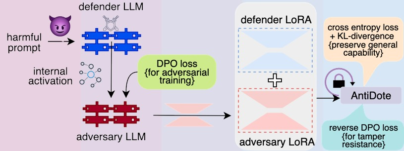
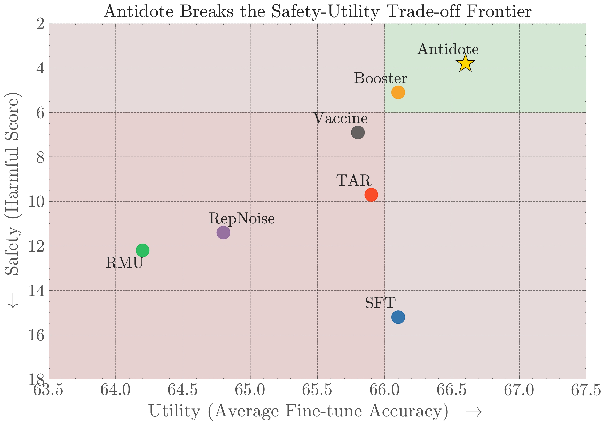
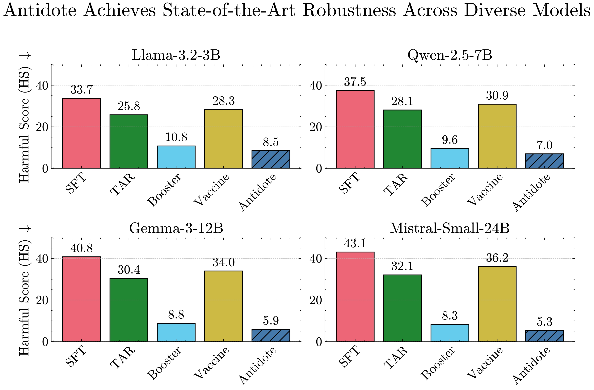
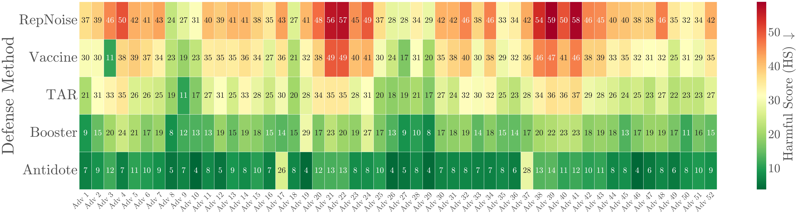

# 🧬 AntiDote: Bi-level Adversarial Training for Tamper-Resistant LLMs

**AAAI 2026 Submission (Paper ID: ‭#29564‬)**

---

### Authors
**Debdeep Sanyal**, **Manodeep Ray**, and **Murari Mandal**  
RespAI Lab, School of Computer Engineering, KIIT Bhubaneswar, India  

📄 **arXiv Pre-print:** [https://arxiv.org/abs/2509.08000](https://arxiv.org/abs/2509.08000)

---

## 🧠 Abstract

The release of open-weight large language models (LLMs) creates a tension between advancing accessible research and preventing misuse, such as malicious fine-tuning to elicit harmful content. Current safety measures struggle to preserve the general capabilities of the LLM while resisting a determined adversary with full access to the model's weights and architecture, who can use full-parameter fine-tuning to erase existing safeguards.  

To address this, we introduce **AntiDote**, a bi-level optimization procedure for training LLMs to be resistant to such tampering. AntiDote involves an **auxiliary adversary hypernetwork** that learns to generate malicious Low-Rank Adaptation (LoRA) weights conditioned on the defender model's internal activations.  

The defender LLM is then trained with an objective to nullify the effect of these adversarial weight additions, forcing it to maintain its safety alignment.  

We validate this approach against a diverse suite of **52 red-teaming attacks**, including jailbreak prompting, latent space manipulation, and direct weight-space attacks. AntiDote is **up to 27.4% more robust** against adversarial attacks compared to both tamper-resistance and unlearning baselines.  
Crucially, this robustness is achieved with a **minimal trade-off in utility**, incurring a performance degradation of less than **0.5%** across benchmarks including **MMLU**, **HellaSwag**, and **GSM8K**.  

Our work offers a practical and compute-efficient methodology for building open-weight models where safety is a more integral and resilient property.

---

##  Overview

This repository provides the official implementation for training and evaluating the **AntiDote framework**.

The central methodology of this work consists of a **bi-level optimization game** between a defender LLM and an adversarial hypernetwork. The adversary learns to generate malicious LoRA patches to compromise the defender, while the defender, in turn, learns to nullify these attacks.  

This dynamic co-evolutionary process yields a model that is **resilient to tampering by design**.

---

### Figure 1
<p align="center">
  
  <br>
  <em>Figure 1: Overview of the AntiDote training framework.</em>
</p>

The adversary (red) generates a malicious LoRA patch based on the defender's internal activations. The defender (blue) is trained with two decoupled objectives: a tamper-resistance loss (on the attacked model) and a capability-preservation loss (on the clean model).

---

##  Requirements

Here is a **cleaned, corrected, and polished** version of your section.

---

## **Software**

The implementation is built using **Python 3.10**.
It is recommended to use a virtual environment for dependency management:

```bash
# Create and activate a virtual environment
python3.10 -m venv venv
source venv/bin/activate

# Install dependencies
pip install -r requirements.txt
```

###  Key Dependencies

```
python==3.10
torch
transformers
numpy
datasets
peft        # for LoRA adapters
```

### Required Environment Variables

Set the following before running the project:

```bash
export OPENAI_API_KEY=sk-...
export HF_TOKEN=...
export HF_WRITE_TOKEN=...
export MISTRAL_API_KEY=...
```

(If you're on Windows PowerShell: use `$env:OPENAI_API_KEY="sk-..."` etc.)


---

###  Hardware

All experiments were conducted using **3× NVIDIA A6000 (48GB)** GPUs.
Thanks to the parameter-efficient design, AntiDote can also be executed on **consumer-grade GPUs**.

---

## Datasets

AntiDote is trained and evaluated on a diverse collection of safety and capability datasets.

### Safety Training (𝓓ₛₐ𝒻ₑ)

* BeaverTails
* Do-Not-Answer

### Utility Preservation (𝓓꜀ₐₚ)

* LIMA
* Unnatural Instructions
* MATH

### Evaluation (Safety)

* BeaverTails (test split)
* StrongREJECT
* HarmBench
* XSTest

### Evaluation (Utility)

* MMLU
* GSM8K
* HellaSwag
* PrOntoQA

<!-- #### Data Preparation

```bash
# Download datasets
bash scripts/download_datasets.sh

# Preprocess and format data
python scripts/preprocess_data.py --output_dir ./data/processed
``` -->

---

##  Usage

### Training

To train a model (e.g., Llama-3.2-3B) with AntiDote:

```bash
acelerate launch training.py \
  --model_name "Qwen/Qwen2.5-7B" \
  --harmful_path "data/my_dpo.json" \
  --it_path "data/my_it.json" \
  --save_path "result/hardened_model"
```


---

## 📊 Results

### Breaking the Safety–Utility Trade-off

AntiDote achieves **state-of-the-art safety** with **minimal utility degradation**.
As shown below, AntiDote (yellow star) lies in the quadrant of **high safety and high utility**.

<p align="center">
  
  <br>
  <em>Figure 2: Safety-Utility Trade-off (Figure 4 in paper).</em>
</p>

---

###  Robustness Across Diverse Models

<p align="center">
  
  <br>
  <em>Figure 3: Harmful Score comparison across model families.</em>
</p>

---

### 🧠 Robustness Across 52 Red-Teaming Attacks

<p align="center">
  
  <br>
  <em>Figure 4: Per-attack harmfulness heatmap showing AntiDote’s generalizable resilience.</em>
</p>

---

## 📈 Key Results Tables

### Table 1: AntiDote Preserves General Capabilities

| Method       | MMLU (FA↑) | GSM8K (FA↑) | HellaSwag (FA↑) | ProntoQA (FA↑) | Avg (FA↑) | Avg (HS↓) |
| ------------ | ---------- | ----------- | --------------- | -------------- | --------- | --------- |
| SFT          | 75.2       | 35.1        | 85.6            | 68.9           | 66.2      | 15.2      |
| RMU          | 73.1       | 33.5        | 83.9            | 66.2           | 64.2      | 12.2      |
| Booster      | 75.0       | 34.3        | 85.4            | 68.0           | 65.8      | 7.3       |
| TAR          | 74.5       | 34.2        | 84.8            | 67.5           | 65.3      | 9.7       |
| RepNoise     | 74.1       | 33.9        | 84.2            | 67.0           | 64.8      | 11.4      |
| Vaccine      | 74.8       | 34.5        | 85.1            | 67.9           | 65.6      | 8.4       |
| **AntiDote** | **75.8**   | **35.5**    | **86.1**        | **68.3**       | **66.4**  | **6.3**   |

---

### Table 2: Superior Safety and Utility Across Diverse Models

| Model         | Metric | SFT  | RMU  | Booster | TAR  | RepNoise | Vaccine | **AntiDote** |
| ------------- | ------ | ---- | ---- | ------- | ---- | -------- | ------- | ------------ |
| Qwen-2.5-0.6B | FA↑    | 88.1 | 85.2 | 88.0    | 87.5 | 87.9     | 87.8    | **88.5**     |
|               | HS↓    | 31.5 | 28.1 | 8.1     | 24.1 | 30.8     | 26.5    | **5.1**      |
| Llama-3.2-3B  | FA↑    | 90.2 | 87.1 | 90.3    | 89.4 | 90.1     | 90.9    | **90.8**     |
|               | HS↓    | 33.7 | 29.5 | 8.3     | 25.8 | 32.9     | 28.3    | **5.3**      |
| Falcon-H1-7B  | FA↑    | 89.5 | 88.4 | 91.1    | 91.4 | 91.3     | 91.1    | **91.9**     |
|               | HS↓    | 36.2 | 31.8 | 8.6     | 27.2 | 35.1     | 30.1    | **5.7**      |
| Gemma-3-27B   | FA↑    | 94.1 | 91.5 | 95.0    | 94.2 | 94.9     | 94.7    | **95.3**     |
|               | HS↓    | 44.2 | 38.9 | 13.5    | 33.0 | 43.5     | 37.1    | **9.8**      |

---

##  Citation

If you find this work useful, please cite:

```bibtex
@misc{sanyal2025antidotebileveladversarialtraining,
      title={AntiDote: Bi-level Adversarial Training for Tamper-Resistant LLMs}, 
      author={Debdeep Sanyal and Manodeep Ray and Murari Mandal},
      year={2025},
      eprint={2509.08000},
      archivePrefix={arXiv},
      primaryClass={cs.CL},
      url={https://arxiv.org/abs/2509.08000}, 
}
```

---

##  Contact

For inquiries related to the paper or code:

* **Debdeep Sanyal** → [debdeep.respailab@gmail.com](mailto:debdeep.respailab@gmail.com)
* **Manodeep Ray** → [manodeepray1@gmail.com](mailto:manodeepray1@gmail.com)
* **Murari Mandal** → [murari.mandalfcs@kiit.ac.in](mailto:murari.mandalfcs@kiit.ac.in)

Alternatively, open a **GitHub Issue** in this repository.

